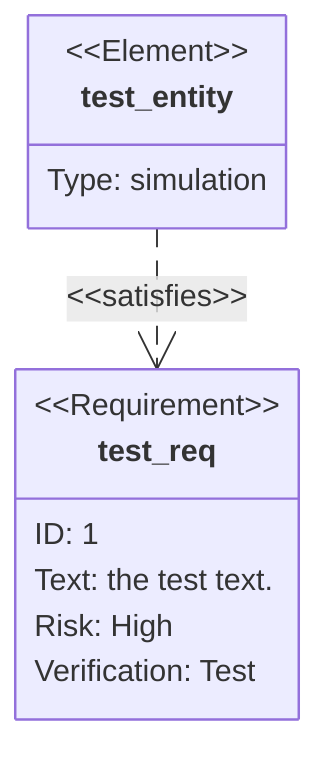

+++
title = "Backend Documentation"
summary = "Developer guides and reference for MyPaint's backend code"
+++

This section concisely describes fundamental aspects of the project's technology,
including files and technical concepts to help developers conceptualise MyPaint.
The most detailed documentation for the project will always be contained within
the source code.<!--more-->

# Contributor Responsibilities
- Please write code that matches what you see elsewhere. [Style guide]()
- [Git workflow]()
- Contributed code must abide by our [Licensing Policy]()
- [Keep these docs up to date]()
- [Documenting your code properly]()

# Technology Overview
Here is a simplified (and somewhat outdated, sorry!) module dependency overview
(some "weak" dependencies are not shown):

# Tooling
MyPaint (the painting application) is written in Python. MyPaint uses GTK for its
user interface, some of the more complicated bits are designed in Glade. Some parts
are coded in C++ for speed. Its brush engine is written as a portable C++ library.
- [Building](), Testing, & Packaging
    - Setup.py uses distutils
    - Tests use nose
    - GitHub actions for CI
- [GUI]()
    - PyGObject (PyGI)
    - Parts of the GUI are constructed in GLADE, other parts in the Python code
- [Canvas]()
    - NumPy
    - Cairo
- [Brush engine]()
    - libmypaint

## Windows
MyPaint uses [MSYS2](https://msys2.github.io/) for porting onto the Windows platform.

# Pages in this Section
