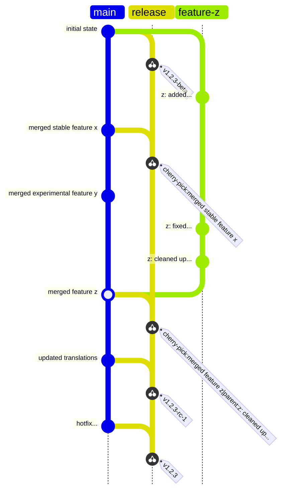

+++
title = "Git Workflow"
summary = "How to use Git when Working with MyPaint"
+++

This page describes contributor and maintainer workflows for contributing patches using git.

# Contributors
1. [Fork][github-fork] and [branch][git-branch] the relevant [MyPaint repository][github-mypaint]
2. Commit changes using [git][git]
3. Create a [pull request][github-pr] or draft pull request on the relevant MyPaint
repository and branch.
4. A project maintainer will review your code and accept it, reject it, or make suggestions.
    - If your pull request is incompatible with the development branch, we'll guide
you through rebasing or force pushing it.

## Branches
- Use separate branches per each fix or enhancement.
    - This helps the maintainers keep understand how the pull request's topic relates
to changes in the code.
- Split commits logically, either by being selective with files, or [staging interactively][git-interactive-staging].

## Dead Code
Dead code, also known as commented-out code, has the potential to cause a lot of
harm as commented-out code quickly becomes out of date and misleading. We have version
control anyway, so people can just look at the commit log.

## Writing Commit Messages
Each commit you contribute should have a good commit message. Here's an example
of a good MyPaint commit message:

```
Splarp view: fix rotation direction.

The direction of rotation for the splarp was incorrect.
When the user turned it clockwise, it went anticlockwise
and vice versa. This commit swaps the two directions.

Closes mypaint/mypaint#666.
Makes mypaint/libmypaint#999 a little better.
```

### Formatting Commit Messages
- Firstly, [this][commit-advice] is a good read on how commit messages work.
- Format commits so that each line is less than 72 characters long.
- Make sure that the summary line is 50 characters or less.
- Separate the summary line from the body with a blank line.

### Structure of a Commit Message
- Summary line: ``<thing-you-changed>: <what-you-did-to-it>``. Not every commit
summary follows the convention, but many do.
- If a commit fixes or refers to an issue, please refer to the issue by number,
either as `mypaint/mypaint#nnn` or as `mypaint/libmypaint#nnn`.
    - This issue reference notation will allow the main repository to receive mentions
from your forked repository.
- If a commit fixes an issue, write a message that [automatically closes the
issue][github-close-issue] when merged.

# Workflow for Maintainers
## Git Branches


## Pull Requests
### Why Pull Requests?
Pull requests are a good organisational unit that ensures contributed code that
isn't merged won't be forgotten. On our side, it makes it easier to review changes you make.

### Merging Pull Requests
- Check [licenses]()
- Merge to ``development`` or a feature branch. **Do not** merge to main unless
releasing a new version.
- Review the files changed.
- Test the changes locally.

### Unit tests
Please run the doctests before committing new code.
```console
# apt-get install python-nose
$ python setup.py nosetests
```
We have some heavier conformance tests for the C++ parts too. These take
longer to run.
```console
$ python setup.py test
```
You should write doctests for important new Python code. Please consider
writing tests in the `tests` folder too, if you make any changes to the
C++ extension or `libmypaint`.

To cleanup between unit tests you may want to run:
```console
$ python setup.py clean --all
$ rm -vf lib/*_wrap.c*
```

### Changelog
Notable changes to MyPaint should be referenced in MyPaint's changelog.

[git]: https://git-scm.com/
[git-branch]: https://git-scm.com/book/en/v2/Git-Branching-Branches-in-a-Nutshell
[git-interactive-staging]: https://git-scm.com/book/en/v2/Git-Tools-Interactive-Staging
[github-close-issue]: https://docs.github.com/en/issues/tracking-your-work-with-issues/linking-a-pull-request-to-an-issue
[github-fork]: https://docs.github.com/en/pull-requests/collaborating-with-pull-requests/working-with-forks/fork-a-repo
[github-mypaint]: https://github.com/mypaint/
[github-pr]:https://docs.github.com/en/pull-requests/collaborating-with-pull-requests/proposing-changes-to-your-work-with-pull-requests/about-pull-requests
[commit-advice]: https://tbaggery.com/2008/04/19/a-note-about-git-commit-messages.html
