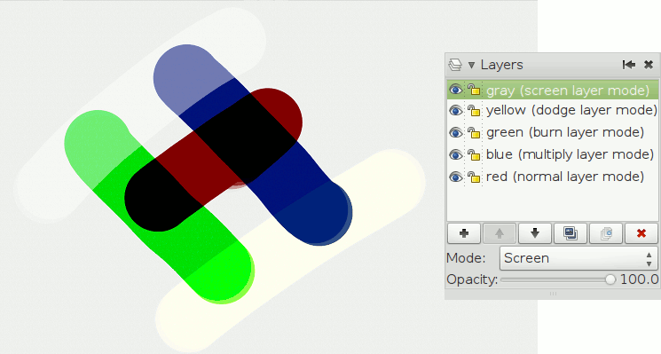

+++
title = "v0.9.0 User Manual"
date = 2011-01-01T12:00:00Z
summary = "Learn how to use MyPaint v0.9.0"
hideSummary = true
showTOC = true
[[cascade]]
sectionNavURL = "/docs/manuals/v0.9.0"
+++

This section is supposed to be a reference on what and how you can do things in
MyPaint. It does not aim to teach you how to paint.



# Files
-   Formats
    - Currently, MyPaint can save your work in 3 formats: PNG, JPEG, ORA ([OpenRaster](http://en.wikipedia.org/wiki/OpenRaster)).
    -   You should always save a copy in ORA to keep all the information, so that
you can continue working later, as the PNG and JPEG formats do not keep the layers' information
    - Gimp 2.7.1 and 2.8 are capable of opening ORA's. Gimp 2.6 requires the plugin
"OpenRaster load/save handler" (the plugin & installation procedure are detailed
here: http://registry.gimp.org/node/18435)
-   Scraps: quick-save the current version of your work
    - It's faster than saving your file under a different name when you are just
experimenting
    - The default folder scraps are saved will be the ".mypaint" or "MyPaint" folder
for your user.
-   DE integration and interoperability

# Canvas
## Change Canvas View
Besides the actions you find under the "View" menu, you can do the following to
change the view of the canvas. These are currently hard-coded and cannot be changed
without editing the source code.
- **Pan/move freely:** Hold space and drag with cursor
- **Pan/move in steps:** Use the arrow keys
- **Rotate freely:** Shift + space and drag with cursor
- **Rotate in steps:** Shift + scroll up/down or Ctrl + left/right arrow key
- **Zoom freely:** Ctrl + space and drag with cursor
- **Zoom:** Scroll up/down

### Tablet-based Canvas Manipulation

MyPaint (currently only the development version) has a menu (Edit\>Preferences\>Buttons)
where you can adjust multiple mouse/pen-based functions for controlling the view of the canvas.

By default, they are:


|Keyboard & Button Combination|Effect|
|---|---|
|Button 1|(Is hard-coded and cannot be changed.)|
|Shift + Button 1|Straight Line|
|Ctrl (or Alt) + Button 1|Pick Color|
|Button 2|Pan|
|Shift + Button 2|Rotate|
|Ctrl (or Alt) + Button 2|Zoom|
|Button 3|Color History|
|Shift + Button 3|(None)|
|Ctrl (or Alt) + Button 3|(None)|

**Buttons 1, 2, and 3 refer to primary (usually left) click, secondary (usually
right) click, and middle click, respectively.**
- **Color History:** Shows a small window containing the five most recently used
colors and cycles through them.
- **Menu:** Useful for fullscreen. Opens a small drop-down version of the menubar
at the cursor.
- **Pick Color:** Selects the color under the cursor. Samples all visible layers.
- **Pick Context:** Selects the brush and color used to make the brush stroke
under the cursor. Also selects the layer the brush stroke is on.
- **Select Layer at Cursor:** Selects the layer on which the brush stroke under
the cursor is on.
- **Pan:** While held, *grabs* and moves the view of the canvas.
- **Zoom:** While held, allows arbitrary zooming in or out.
- **Rotate:** While held, allows arbitrary rotation.
- **Straight Line:** Any clicks made using Straight Line will make a straight
line to the last point clicked without Straight Line. Useful for making perspective lines.
- **Sequence of Straight Lines:** Similar to the Straight Line function. Every
click will make a straight line to the last place clicked, instead of just one point
chosen before using the tool. Can be used to make shapes instead of perspective lines.
- **Color Changer:** Brings up the Color Changer dialog.
- **Color Ring:** Brings up the Color Ring dialog.
- **Toggle Subwindows:** Same as pressing the Tab key. Hides/Shows all dialogs
and windows besides the main painting area.

# Brushes
(Not covered yet:)
-   Editing and creating brushes
-   [Pick context]()

## Brush Packs


### Install a Brush Package
Download the ZIP file, for example from the official [Brush Packages]()
page. Don't extract it. In MyPaint, open the *Brush* menu or right-click on the
brush group labels. Choose *Import brush package* and select the ZIP file. (Note:
Menu in 0.8.2 does not have import/export options)

If you already have a brush or group in the package, you are given the choice to
rename or overwrite it. If you choose to rename, MyPaint will append a number to the imported name.

### Uninstall a Brush Package
You can delete a brush group by right-clicking on its label. The brushes will reappear
in a group called *deleted* unless they are still part of another group. Or you
can remove the brushes from disk in the brush editor.

As an alternative, You can quit MyPaint and go to *.mypaint/brushes/* in your home
directory and simply delete the files/folders you don't need. Be careful to always
delete *brushname.myb* and *brushname\_prev.png* together, not only one of them.
You can overwrite MyPaint standard brushes, but you cannot truely delete them. If
you try, the original will always reappear in the *deleted* group.

### Create a Brush Package
Right-click on the group label to export that group as a package. That's it.

You can add a file called *readme.txt* to the ZIP, which will be displayed to the
user before the importing. You can also put several groups into a single brush package,
with a bit extra work. For this you have to combine the content of several ZIP files
and edit *order.conf* to match. MyPaint is quite picky when importing a brush package,
so please try to import it before you distribute it.

It is good practice (but not required) to put all your brushes into a personal folder.
You can do this by renaming the brushes to something like "artistname/brush1". MyPaint
will create the directory "artistname" for you. For mass-renaming, it may be easier
to quit MyPaint, move move brushes into a subdirectory manually and edit *.mypaint/brushes/order.conf*.

You may want to move or copy the folder *.mypaint/brushes/* to a safe place before
you start testing, and put it back when you are done. Quit MyPaint before you rearrange things there.

## The Brushes Menu

*Note that the shortcut keys are shown in Uppercase (better readability) but must
be typed in Lowercase.*

### Brushes handling
- **Brush List...** (shortcut: B): toggles (on/off) the brushes selection window
- **Brush keys**
- **Brush Settings...** (shortcut: Ctrl+B): toggles (on/off) the brushes settings window
    - This window contains all the parameters composing a brush: radius, opacity,
size of the dabs comprising the stroke, etc. It displays a complex list of options.

### Dynamic changes on the current brush (while painting)
- **Bigger** (default shortcut: F): Makes the brush's radius wider.
    - This shortcut will add 0.3 to the property "radius\_logarithmic" of the brush
(its range is -2.0 to 5.0). The initial value depends of the brush
    - You will notice that the *cursor* stops growing after a few changes (up to
8, depending on the initial size for the current brush), but the *strokes* (the paint)
radius will continue to grow
    - The strokes will not necessarily respect the cursor's boundaries (contrarily
to programs like GIMP), it depends on the brush parameters
    - When you switch brushes, the size changes are forgotten: when you select that
same brush again it will go back to its original size (create a custom brush if
you want to keep a specific size handy)
- **Smaller** (default shortcut: D): Makes the brush's radius narrower.
    - This shortcut will subtract 0.3 to the property "radius\_logarithmic" of the
brush (its range is -2.0 to 5.0). The initial value depends of the brush
    - You will notice that the *cursor* stops shrinking after a few changes (up
to 8, depending on the initial size for the current brush), but the *strokes* (the paint) radius will continue to shrink
    - The strokes will not necessarily respect the cursor's boundaries (contrarily
to programs like GIMP), it depends on the brush parameters
    - When you switch brushes, the size changes are forgotten: when you select that
same brush again it will go back to its original size (create a custom brush if
you want to keep a specific size handy)
- **More Opaque** (default shortcut: S): Makes the brush's strokes more Opaque.
    - This shortcut will multiply 1.8 with the property "opaque" of the brush (its
range is 0.0 to 2.0). This means that if the brush has an Opaque value of "0", this
shortcut doesn't work (since x \* 0 = 0). The initial value depends of the brush
- **Less Opaque** (default shortcut: A): Makes the brush's strokes less Opaque.
    - This shortcut will divide the property "opaque" of the brush by 1.8 (its range
is 0.0 to 2.0). This means that the brush will never reach "0", its minimum value
is "0.01". The initial value depends of the brush
- **Toggle Eraser Mode** (default shortcut: E): Changes the brush's strokes to erase mode.
    - This shortcut will switch the property "eraser" between 0 (paint) and 1 (erase).
The brush's radius is also expanded by 0.9 (by default), if you change the radius
of the brush while in eraser mode, the new value is used afterwards (so the eraser
radius will grow or shrink according to this new value)
    - All the other properties are kept, which means that the eraser will use the
same strokes as the current brush (allowing interesting effects). This is not the
same as using an eraser in programs like GIMP.
    - If you need a more classical eraser, there are some specific brushes (eg:
look in the "Classic" group)
- **Toggle Alpha Lock** (default shortcut ???): Changes the brush's strokes to not
affect transparency (alpha channel).
    - This shortcut will switch the property "alpha lock" between 0 (normal painting)
and 1 (alpha locked)
- **Toggle Colorize** (default shortcut k): Changes the brush's strokes to only affect hue and saturation.
    - This shortcut will switch the property "colorize" between 0 (normal painting)
and 1 (only affect hue and saturation)

## Brush Settings
This window contains all the parameters composing a brush: radius, opacity, size
of the dabs comprising the stroke, etc.

Each setting is represented on a line with:
- Name of the parameter (radius, hardness, etc.)
- Current value: each setting has a value on a range that varies according to the
type of parameter (0.0 to 2.0, -1.0 to 7.0, 0.0 to 180.0, etc).
- Slider (to modify the value)
- Default value button (resets the parameter to the default value indicated on the button)
- (optional) extended parameters button with 2 possible values:
    - "..." Add input values mapping
    - "X" Modify input values mapping

The best way to understand how the parameters affect your brush is to draw a line
on the canvas. Open your brushes settings window, check the "Live update the last
canvas stroke" box then use the sliders to change the settings value. The changes
are dynamically visible on the canvas.

## Parameters list
Maybe you want to read [How to Make Brushes on MyPaint][make-brushes] by Ramón Miranda
for detailed explanations.

[make-brushes]: http://ramonmirandavisualart.blogspot.com/2011/04/mypaint-how-to-make-brushes-on-my-paint.html

### Basic
- **Radius:** basic brush radius (logarithmic). 0.7 means 2 pixels. 3.0 means 20 pixels
- **Radius by random:** Alter the radius randomly each dab. You can also do this
with the by\_random input on the radius setting. If you do it here, there are two
differences:. 1) the opaque value will be corrected such that a big-radius dabs
is more transparent. 2) it will not change the actual radius seen by dabs\_per\_actual\_radius
- **Hardness:** hard brush-circle borders (setting to zero will draw nothing)
- **Anti-aliasing:** (info needed)
- **Eraser:** how much this tool behaves like an eraser. 0.0 normal painting. 1.0
standard eraser. 0.5 pixels go towards 50% transparency
- **Jitter:** add a random offset to the position where each dab is drawn. 0.0 disabled.
1.0 standard deviation is one basic radius away. \<0.0 negative values produce no jitter
- **Elliptical dab**
    - *Angle:* this defines the angle by which elliptical dabs are tilted. 0.0 horizontal
dabs. 45.0 45 degrees, turned clockwise. 180.0 horizontal again
    - *Ratio:* aspect ratio of the dabs; must be \>= 1.0, where 1.0 means a perfectly round dab.
- **Direction filter:** a low value will make the direction input adapt more quickly,
a high value will make it smoother

### Opacity
- **Opacity:** 0 means brush is transparent, 1 fully visible. (also known as alpha or opacity)
- **Opacity multiply:** This gets multiplied with opaque. It is used for making
opaque depend on pressure (or other inputs).
- **Opacity linearize:** Correct the nonlinearity introduced by blending multiple
dabs on top of each other. This correction should get you a linear ("natural") pressure
response when pressure is mapped to opaque\_multiply, as it is usually done. 0.9
is good for standard strokes, set it smaller if your brush scatters a lot, or higher
if you use dabs\_per\_second.. 0.0 the opaque value above is for the individual
dabs. 1.0 the opaque value above is for the final brush stroke, assuming each pixel
gets (dabs\_per\_radius\*2) brushdabs on average during a stroke
- **Lock alpha:** (info needed)

### Dabs
- **Dabs per basic radius:** how many dabs to draw while the pointer moves a distance
of one brush radius (more precise: the base value of the radius)
- **Dabs per actual radius:** same as above, but the radius actually drawn is used,
which can change dynamically
- **Dabs per second:** dabs to draw each second, no matter how far the pointer moves

### Smudge
- **Smudge:** Paint with the smudge color instead of the brush color. The smudge
color is slowly changed to the color you are painting on.. 0.0 do not use the smudge
color. 0.5 mix the smudge color with the brush color. 1.0 use only the smudge color
- **Smudge length:** This controls how fast the smudge color becomes the color you
are painting on.. 0.0 immediately change the smudge color. 1.0 never change the smudge color
- **Smudge radius:** (info needed)

### Speed
- **Fine speed filter:** how slow the input fine speed is following the real speed.
0.0 change immediately as your speed changes (not recommended, but try it)
- **Gross speed filter:** same as 'fine speed filter', but note that the range is different
- **Fine speed gamma:** This changes the reaction of the 'fine speed' input to extreme
physical speed. You will see the difference best if 'fine speed' is mapped to the
radius.. -8.0 very fast speed does not increase 'fine speed' much more. +8.0 very
fast speed increases 'fine speed' a lot. For very slow speed the opposite happens.
- **Gross speed gamma:** same as 'fine speed gamma' for gross speed
- **Offset by speed:** change position depending on pointer speed. = 0 disable.
\> 0 draw where the pointer moves to. \< 0 draw where the pointer comes from
- **Offset by speed filter:** how slow the offset goes back to zero when the cursor stops moving

### Tracking
- **Slow position tracking:** Slowdown pointer tracking speed. 0 disables it, higher
values remove more jitter in cursor movements. Useful for drawing smooth, comic-like outlines.
- **Slow tracking per dab:** Similar as above but at brushdab level (ignoring how
much time has past, if brushdabs do not depend on time)
- **Tracking noise:** add randomness to the mouse pointer; this usually generates
many small lines in random directions; maybe try this together with 'slow tracking'

### Stroke
- **Stroke threshold:** How much pressure is needed to start a stroke. This affects
the stroke input only. Mypaint does not need a minimal pressure to start drawing.
- **Stroke duration:** How far you have to move until the stroke input reaches 1.0.
This value is logarithmic (negative values will not inverse the process).
- **Stroke hold time:** This defines how long the stroke input stays at 1.0. After
that it will reset to 0.0 and start growing again, even if the stroke is not yet
finished.. 2.0 means twice as long as it takes to go from 0.0 to 1.0. 9.9 and bigger stands for infinite

### Color
- **Change color hue:** Change color hue.. -0.1 small clockwise color hue shift.
0.0 disable. 0.5 counterclockwise hue shift by 180 degrees
- **Change color lightness (HSL):** Change the color lightness (luminance) using
the HSL color model.. -1.0 blacker. 0.0 disable. 1.0 whiter
- **Change color satur. (HSL):** Change the color saturation using the HSL color
model.. -1.0 more grayish. 0.0 disable. 1.0 more saturated
- **Change color value (HSV):** Change the color value (brightness, intensity) using
the HSV color model. HSV changes are applied before HSL.. -1.0 darker. 0.0 disable. 1.0 brighter
- **Change color satur. (HSV):** Change the color saturation using the HSV color
model. HSV changes are applied before HSL.. -1.0 more grayish. 0.0 disable. 1.0 more saturated
- **Save color:** (info needed)
- **Colorize:** (info needed)

### Custom
- **Custom input:** Set the custom input to this value. If it is slowed down, move
it towards this value (see below). The idea is that you make this input depend on
a mixture of pressure/speed/whatever, and then make other settings depend on this
'custom input' instead of repeating this combination everywhere you need it.. If
you make it change 'by random' you can generate a slow (smooth) random input.
- **Custom input filter:** How slow the custom input actually follows the desired
value (the one above). This happens at brushdab level (ignoring how much time has
past, if brushdabs do not depend on time).. 0.0 no slowdown (changes apply instantly)

# Color
## The Color Menu

- **Color Triangle...** (shortcut: G): classic wheel + triangle color selection

- **Color Ring**: displays the Color Changer Wheel (see Color Changer), same as
using the shortcut V twice.

- **Color Changer** (shortcut: V & VV): displays the Color Changer, then if you
press the shortcut again, displays the Color Changer Wheel

 

- **Pick Color** (shortcut: R); enables the color picker (click on the screen on
a color you want to use)

- **Color History** (shortcut: X): switch between the last 5 *used* colors
    - Every time you use a color *to paint*, this color is added to the left of
the list, pushing the others colors to the right. The last color to the right of the list is forgotten.

-   **Color Sampler...** (shortcut: T)

   

- The *Color Selector* is composed of a HSV wheel.
    - The most external wheel is used to choose the Hue (the tint: red, yellow,
green, cyan, blue, magenta).
    - The innermost rectangle allows you to choose the Saturation & Value (Saturation:
intensity of the color, grey being the lowest saturation; Value: the brightness, 0 being black).
    - The inner wheel displays the main Hues with the current Saturation & Value.
This is especially useful with the harmonies.
- **Colors History**: displays the last 5 *used* colors
    - Every time you use a color *to paint*, this color is added to the left of
the list, pushing the others colors to the right. The last color to the right of the list is forgotten.
    -   You can switch between them using the shortcut X, or a mouse right-click
- **Details**: to choose your color using the classic RGB or HSV slides
- **Harmonies** : shows colors relationships
    - When an harmony option is selected, the colors with the selected relationships
are shown with a visual cue (circle, square, triangle) inside the inner wheel. This
shows for instance which color is the complementary, or which colors are analogous of your current selection.
    -   More examples here: http://www.tigercolor.com/color-lab/color-theory/color-harmonies.htm
    -   More details on color here: http://en.wikipedia.org/wiki/Category:Color

# Layers
## The Layers Menu

## Layer Modes
Layer modes are a special function that allow you to apply one layer as a modifier
to the lower layers. It could be considered analogous to tranparencies on overhead
projectors. There are currently four layer modes, not counting "Normal".
- **Normal:** No special effect. Layer simply has an alpha channel with no interactions between layers.
- **Multiply:** (description pending)
- **Burn:** (description pending)
- **Dodge:** (description pending)
- **Screen:** (description pending)

# Version History & Comments
[Source page (Archived)](https://web.archive.org/web/20150328063506/http://wiki.mypaint.info:80/Documentation/Manual)
    - The archived page is not necessarily the version shown here

## 2011
> Updated to v0.9.0.
## 2015
> This documentation is *woefully* out of date. The new manual is evolving over at [v1.2 User Manual](), come and help it grow! You can start by stealing some of these old texts, but you'll probably want to make new screenshots...

## 2024-01-25
> Moved this page to the new Hugo site.

Aesara Binder, 25 January 2024

# Pages in this Section
